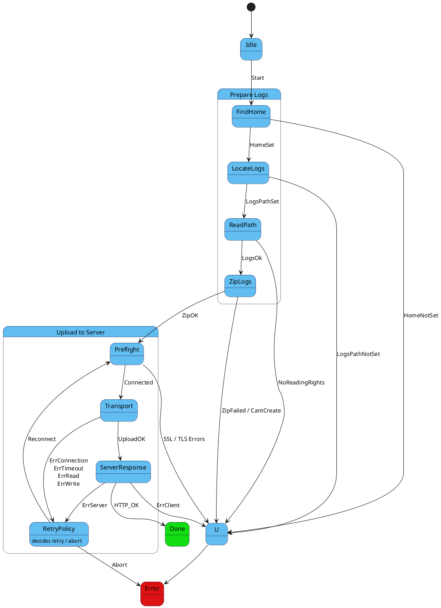

# Pixet Log Shipping

This project automates **log shipping** for Pixet software. It finds the logs directory, compresses it, and securely uploads it to a configured server.

## Features

- **Compression**: Uses `miniz` to zip the `logs` folder.
- **Security**: Uploads via **HTTPS** using `httplib` (OpenSSL wrapper) with certificate verification.
- **Cross-platform**: Works on Windows, Linux, and macOS.
- **Resilient**: Implements a retry policy for network failures.

---

## Dependencies

- **miniz** – for zipping (bundled in `3rdparty/`)
- **httplib.h** – HTTP/HTTPS client (bundled in `3rdparty/`)
- **OpenSSL 3.0** – Required for HTTPS support.

---

## Configuration

- **Server**: Configured to upload to a specific endpoint (default: `localhost:5000` for testing).
- **Security**: Requires a valid SSL certificate structure.
    - For local testing, generate self-signed keys: `./generate_self-signed_keys.sh`
- **Log Location**: Automatically detects `~/.config/PixetPro/logs`.

---

## Build and Run

1. **Start the Mock Server** (optional, for testing):
    ```bash
    python server.py
    ```

2. **Build**:
    ```bash
    cmake -B build
    cmake --build build
    ```

3. **Run**:
    ```bash
    ./build/log_uploader
    ```

## Tests

The project includes a standalone test for the `LogUploader`:

```bash
cmake --build build --target test_log_uploader
cd build && ./test_log_uploader
```
*(Ensure `server.crt` and `server.key` are in the execution directory for SSL tests)*

---

## Architecture

The application is controlled by a **Finite State Machine (FSM)** ensuring deterministic behavior.



### States

| State | Description |
| :--- | :--- |
| **Idle** | Initial state, waiting for start event. |
| **FindHome** | Detects user's home directory. |
| **LocateLogs** | Resolves the path to the `logs` directory. |
| **ReadPath** | Verifies read permissions for the logs. |
| **ZipLogs** | Compresses the logs directory into a zip file. |
| **UploadToServer** | Handles the HTTPS upload (Connect -> Send -> Receive Response).|
| **RetryPolicy** | Decides whether to retry or abort upon failure. |
| **Done** | Upload successful. |
| **Error** | Critical failure (abort). |

### Error Handling

- **Network Errors**: Connection timeouts, DNS failures, and SSL handshake errors trigger the retry policy.
- **File Errors**: permissions issues or missing files abort the process immediately.

---

## SSL Errors 

### 1. `SSLConnection`

> TLS handshake nelze vůbec navázat

**Typicky**:
- server běží pouze na HTTP, klient je SSLClient
- server zavře socket během handshaku
- nekompatibilní TLS verze / cipher suite
- server není na daném portu

### 2. `SSLServerHostnameVerification`

> Selhání overeni identity serveru (problem duvery)

Hostname v URL (localhost) neodpovídá žádnému SAN v certifikátu. (CN se dnes bere jen jako fallback, SAN je rozhodující)

### 3. `SSLLoadingCerts`

> Klient nedokázal načíst nebo použít své vlastní trust materiály

Týká se výhradně lokální konfigurace klienta.

**Typicky**:
- CA soubor neexistuje
- CA soubor má špatný formát
- CA není čitelná (práva)
- prázdný nebo poškozený cert bundle

### 4. SSLServerVerification

> certifikát je kryptograficky OK, hostname sedí, ale cert chain nekončí v důvěryhodné CA

**Typicky**:
- self-signed cert bez odpovídající CA
- chybějící intermediate CA
- cert podepsaný jinou CA, než klient zná

---

| Error                           | Vrstva        | Přesný význam                        |
| ------------------------------- | ------------- | ------------------------------------ |
| `SSLConnection`                 | Transport/TLS | TLS handshake nelze navázat          |
| `SSLServerHostnameVerification` | Identity      | Certifikát nepatří cílovému hostname |
| `SSLLoadingCerts`               | Client config | Klient nemá použitelnou CA           |
| `SSLServerVerification`         | Trust         | Certifikátu nelze důvěřovat          |
