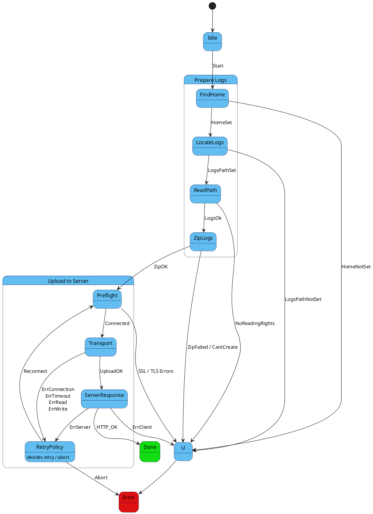

# Pixet Log Shipping
## Introduction

This project performs **log shipping** to a server for the Pixet software, which stores all its telemetry data in `logs` dir located on the user's computer. The current server runs locally on `localhost:5000` using a Python Flask server, which is included in this project.  

The process consists of two main parts:

1. **Find and compress the `logs` folder**  
   - Uses the `libzippp` library for zipping.
2. **Send the zip archive to an HTTPS server**  
   - Uses the header-only `httplib.h` library, which is a wrapper for `OpenSSL 3.0`.

---

## Dependencies
To build and run this project, the following are required:

- **libzippp** – for creating zip archives
- **httplib.h** – header-only cross platform HTTP/HTTPS library
- **OpenSSL 3.0** – for HTTPS support

All libraries are vendored to ensure smooth cross-platform compatibility. On Windows, OpenSSL 3.0 is usually already installed, but for Linux/macOS, make sure paths are correctly set in `CMakeLists.txt`.

---

## Configuration
The communication is secured via **HTTPS**, meaning the client verifies the server’s certificate.  

- Currently, a **self-signed certificate** is used.  
- Private key and public certificate need to be supplied to the server.  
- Keys can be generated by running:

```bash
./generate_self-signed_keys.sh
```

- **Logs location**: By default, the client searches for the `~/.config/PixetPro/logs` folder. This can be modified in the code if needed.
<!-- - **Environment variables (optional)**: TODO for tests
  - `PIXET_LOGS_PATH` – override default logs folder path.
  - `PIXET_SERVER_URL` – override default server URL (`https://localhost:5000`). -->

---

## Build and Run

1. **Start the server**:

```bash
python server.py
```

2. **Build the C++ client**:

```bash
cmake --build build
```

3. **Run the client**:

```bash
./build/main
```

---

## Security Notes

- **RSA keys**: The project uses self-signed RSA keys for local testing.
- **Key management**: Keep private keys secure; do not commit them to version control.
- **Future production setup**: Consider using properly signed certificates and secure key storage solutions (e.g., environment secrets, key vaults).

---

## Technical Details

- **Zip process**: Recursively compresses all files in the logs folder.
- **HTTPS client**: Performs certificate verification and supports TLS 1.2/1.3.
- **Error handling**: Checks for folder existence, file read/write errors, and network failures.
- **Cross-platform**: Compatible with Windows, Linux, and macOS. Paths are resolved properly (tilde expansion is handled for Unix-like systems).

---

## Notes for further Development

- Vendored libraries are located in `3rdparty/`.
- For production use, replace self-signed certificates with a proper CA-signed certificate.

## Architecture (SDD)

Cela aplikace je rizena deterministickym stavovym automatem (FSM). To znamena nekolik veci:

- cela aplikace je v jeden okamzik pouze v jednom stavu (`State`)
- Každý `State`:
  - provede jednu konkrétní operaci
  - vrátí `Event`
  - nesmí řídit přechody přímo

- `State` nesmí:
  - znát další stav
  - dělat retry sám
  - rozhodovat o chybové politice

### FSM definition and implementation

FSM je definovan v `fsm.h`. Cely chod FSM probiha zpusobobem `State -> Event -> FSM -> Next State`.



### Implementation

| FSM State                        | Implementace           | Side-effects       | Výstupní Eventy                       |
| -------------------------------- | ---------------------- | ------------------ | ------------------------------------- |
| `FindHome`                       | `handleFindHome()`     | FS, env vars       | `HomeSet`, `HomeNotSet`               |
| `LocateLogs`                     | `handleFindHome`       | FS                 | `LogsPathSet`, `LogsPathNotSet`       |
| `ReadPath`                       | `handleReadPath`       | FS (permissions)   | `LogsOk`, `NoReadingRights`           |
| `ZipLogs`                        | `handleZipLogs`        | FS, compression    | `ZipOK`, `ZipFailed`, `ZipCantCreate` |
| `UploadToServer[Preflight]`      | `handlePreflight`      | DNS, TLS handshake | `Connected`, `ErrSSL*`                |
| `UploadToServer[Transport]`      | `handleTransport`      | Socket I/O         | `ErrConnection`, `Err*`               |
| `UploadToServer[ServerResponse]` | `handleServerResponse` | HTTP parsing       | `HTTP_OK`, `ErrClient`, `ErrServer`   |
| `RetryPolicy`                    | `handleRetryPolicy`    | sleep / counters   | `Reconnect`, `Abort`                  |

### Why UploadToServer is a single FSM state

Although the upload process is logically divided into Preflight, Transport
and ServerResponse phases, it is implemented as a single FSM state.

**Reason**
- `httplib` performs TLS handshake, request send and response receive
  synchronously within a single call stack

## SSL Errors 

### 1. `SSLConnection`

> TLS handshake nelze vůbec navázat

**Typicky**:
- server běží pouze na HTTP, klient je SSLClient
- server zavře socket během handshaku
- nekompatibilní TLS verze / cipher suite
- server není na daném portu

### 2. `SSLServerHostnameVerification`

> Selhání overeni identity serveru (problem duvery)

Hostname v URL (localhost) neodpovídá žádnému SAN v certifikátu. (CN se dnes bere jen jako fallback, SAN je rozhodující)

### 3. `SSLLoadingCerts`

> Klient nedokázal načíst nebo použít své vlastní trust materiály

Týká se výhradně lokální konfigurace klienta.

**Typicky**:
- CA soubor neexistuje
- CA soubor má špatný formát
- CA není čitelná (práva)
- prázdný nebo poškozený cert bundle

### 4. SSLServerVerification

> certifikát je kryptograficky OK, hostname sedí, ale cert chain nekončí v důvěryhodné CA

**Typicky**:
- self-signed cert bez odpovídající CA
- chybějící intermediate CA
- cert podepsaný jinou CA, než klient zná

---

| Error                           | Vrstva        | Přesný význam                        |
| ------------------------------- | ------------- | ------------------------------------ |
| `SSLConnection`                 | Transport/TLS | TLS handshake nelze navázat          |
| `SSLServerHostnameVerification` | Identity      | Certifikát nepatří cílovému hostname |
| `SSLLoadingCerts`               | Client config | Klient nemá použitelnou CA           |
| `SSLServerVerification`         | Trust         | Certifikátu nelze důvěřovat          |

